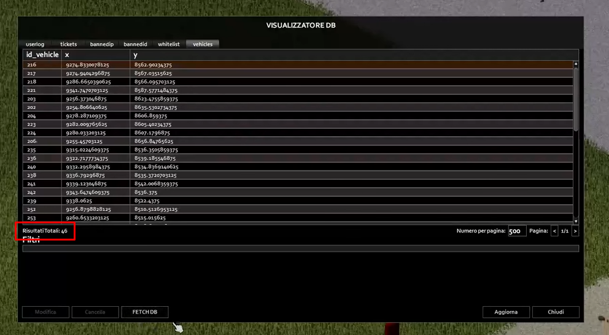
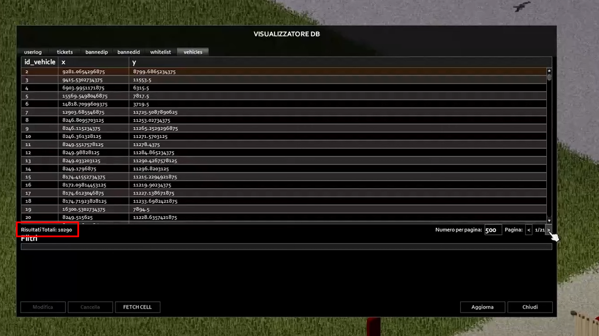

# Vehicles DB Manager for Project Zomboid (LUA MOD + JAVA OPTIONAL MOD)

Still Working in Progress but almost there

The goal of this mod is to extend the existing DB Viewer of the game, which is currently limited to the "NOMESERVER.db" file located in the server's "db" folder. This mod aims to add a display of the vehicles present in the server, which are stored in a different database file in the "Saves/Multiplayer/SERVER/vehicles.db" folder. To achieve this, I made some modifications and additions using Java to ensure these data could be accessed directly.

In theory, running the mod only requires the Java file, allowing the vehicle data to be displayed automatically in the DB Viewer. However, since I also wanted to provide interaction capabilities with each individual vehicle, I decided to add some Lua-side functionality as well. In the end, I figured that not everyone might want to install the Java side of the mod, so I thought, why not create two versions? This way, users also have the option to fetch and display only the vehicles in the cell they're currently in. Initially, the mod fetches the vehicles in the current cell, and if desired and the Java files are installed on the server, users can switch using the "Fetch DB" button to display all vehicles in the server.

And here it is—a working mod, with just a few minor finishing touches needed. It's up to you whether to also install the Java part.

Note: Java files need to be replaced server-side only, not client-side!

- SCREENSHOT FETCH from CELL:
  
- SCREENSHOT FETCH from Vehicles.db:
  

## Explanation

- everything is based on this monkey patching. we add here the new column

```lua
local original_ISWhitelistViewer_refresh = ISWhitelistViewer.refresh
function ISWhitelistViewer:refresh()
    original_ISWhitelistViewer_refresh(self)
     -- Add the 'vehicles' table after the loop
     local vehiclesTab = ISWhitelistTable:new(0, 0, self.panel.width, self.panel.height - self.panel.tabHeight, "vehicles")
     vehiclesTab.columns = {
        "id_vehicle",
        "x",
        "y",
        -- Add other columns as needed -- -- TODO: Will add in the future vehicles name and other things...
    }
     vehiclesTab:initialise()
     self.panel:addView("vehicles", vehiclesTab)
     vehiclesTab.parent = self
     if not self.activeView then
         self.activeView = vehiclesTab
         ISWhitelistTable.instance:getVehiclesTable(0, "vehicles")
         vehiclesTab.loading = true
     end
end
```

## (OPTIONAL JAVA VERSION)

- Java version VehiclesDatabase.class in server path "zombie/network/" need to fetch through SQLLite the vehicles.db from the Server's Saves directory to obtain every single vehicle in game and not only vehicles in the CELL.

- To send the data from vehicles.db from the server to the client, it was enough to hook into a single function in the GameServer.class file.
  Here the function:

```java
// GAMESERVER static void receiveGetTableResult
static void receiveGetTableResult(ByteBuffer var0, UdpConnection var1, short var2) throws SQLException {
      int var3 = var0.getInt();
      String var4 = GameWindow.ReadString(var0);
      ArrayList<DBResult> var5;

      if ("vehicles".equals(var4)) {
         // Get data from vehicles.db
         var5 = VehiclesDatabase.getInstance().getTableResult();

      } else {
         // Get data from the standard database
         var5 = ServerWorldDatabase.instance.getTableResult(var4);
      }

      for (int var6 = 0; var6 < udpEngine.connections.size(); ++var6) {
         UdpConnection var7 = (UdpConnection) udpEngine.connections.get(var6);
         if (var1 != null && var7.getConnectedGUID() == var1.getConnectedGUID()) {
            doTableResult(var7, var4, var5, 0, var3);
         }
      }
   }
```
